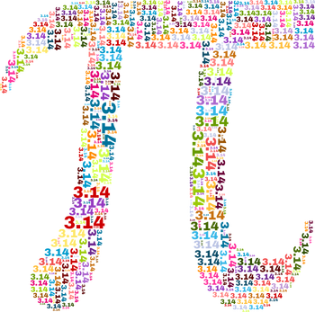
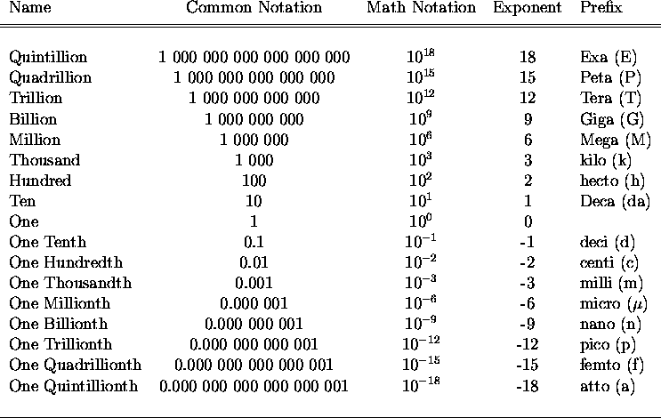

# Random Sampling To Estimate Pi

**Level**: Moderate

**Languages**: Python & R

**Requirements**: 
- Spark 2.3

**Author**: Ian Brooks

**Follow**: [LinkedIn - Ian Brooks PhD](https://www.linkedin.com/in/ianrbrooksphd/)

**Related Links**:

- [The R Project for Statistical Computing](https://www.r-project.org/)
- [The Comprehensive R Archive Network](http://cran.wustl.edu/)
- [Data Visualization With Base R](https://www.r-graph-gallery.com/base-R.html)
- [Matplotlib: Visualization With Python](https://matplotlib.org/)
- [Pandas Visualization](https://pandas.pydata.org/docs/user_guide/visualization.html)
- [Seaborn: Statistical Data Visualization](https://seaborn.pydata.org/)

## Random Sampling

