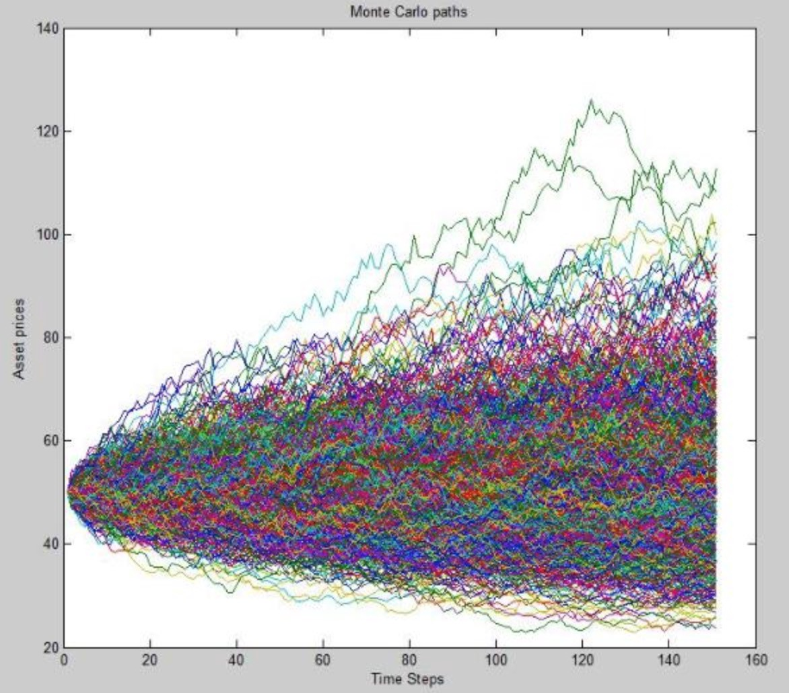

# Random Sampling To Estimate Pi

**Level**: Moderate

**Languages**: Python & R

**Requirements**: 
- Spark 2.3

**Author**: Ian Brooks

**Follow**: [LinkedIn - Ian Brooks PhD](https://www.linkedin.com/in/ianrbrooksphd/)

**Related Links**
- [Monte Carlo Method](https://en.wikipedia.org/wiki/Monte_Carlo_method)
- [Monte Carlo Simulation With Python](https://pbpython.com/monte-carlo.html)
- [Just Keep Guessing: The Power Of The Monte Carlo Method](https://towardsdatascience.com/just-keep-guessing-the-power-of-the-monte-carlo-method-f06bc6f33d19)
- [Monte Carlo Simulation In R With Focus On Option Pricing](https://towardsdatascience.com/monte-carlo-simulation-in-r-with-focus-on-financial-data-ad43e2a4aedf)
- [Solution Manual For Introducing Monte Carlo Methods With R](https://www.r-bloggers.com/solution-manual-for-introducing-monte-carlo-methods-with-r/)
- [Monte Carlo Simulations in R](https://www.r-bloggers.com/monte-carlo-simulations-in-r/)
- [Estimation Pi – A Monte Carlo Simulation](https://www.r-bloggers.com/estimation-of-the-number-pi-a-monte-carlo-simulation/)
- [Approximating Pi With A Monte Carlo Approach](https://www.r-bloggers.com/approximating-the-value-of-pi-with-a-monte-carlo-approach/)
- [A Primer To Monte Carlo Simulation In Python](https://analyticsindiamag.com/a-primer-to-monte-carlo-simulation-in-python/)
- [Estimating Pi With Monte Carlo Simulation In Python](https://medium.com/@utkuarik/estimating-pi-value-with-monte-carlo-simulation-python-5d8a2cedbab9)

## Random Sampling

